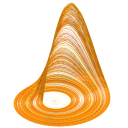

# CHAOSSOFT #

Chaossoft is a set of libraries and tools which allow to model systems of different nature and to perform numeric analysis of timeseries.  
#
  
Novel method to compute LEs based on a modification of the neural network method was designed, implemented in **NeuralNetTsa** tool and **[published](https://www.mdpi.com/1099-4300/20/3/175)** in Entropy journal

#
### ChaosSoft.Core ###
Core of the toolset.

* Custom data series implementation
* Data I/O
* Numerical methods:  
-- Lyapunov exponents related methods  
-- equations solving  
-- phase space reconstruction  
-- orthogonalization  
* Methods from algebra
* Methods from statistics

### TsaToolbox ###
**T**ime **S**eries **A**nalysis **Toolbox**
* Timeseries load and customization of range for analysis
* variety of plots to build (interactive zoomable + enlarged popups):  
-- signal  
-- pseudo-poincare section  
-- autocorrelation  
-- mutual information  
-- false nearest neighbors  
-- wavelets*  
-- FFT*  
\* _matlab compiler runtime 2016b needs to be installed_  

* Lyapunov exponents analysis:  
-- wolf  
-- rosenstein  
-- kantz  
-- sano-sawada

* and some other cool features  

### NeuralNetTsa ###

**Neural Net** **T**ime **S**eries **A**nalysis 
CLI tool which performs forecasting of timeseries, reconstruction of the attractor and calculating some attractor properties  

### Attractor viewer ###
The tool to visualize attractors in 3D.  

### Modelled Systems ###
Big variety of "classic" well-known equatinos systems with ability to perform analysis of different kind
* Map of lyapunov exponents
* LLE and Lyapunov spectrum
* Lyapunov fractals
* Bifucration maps
